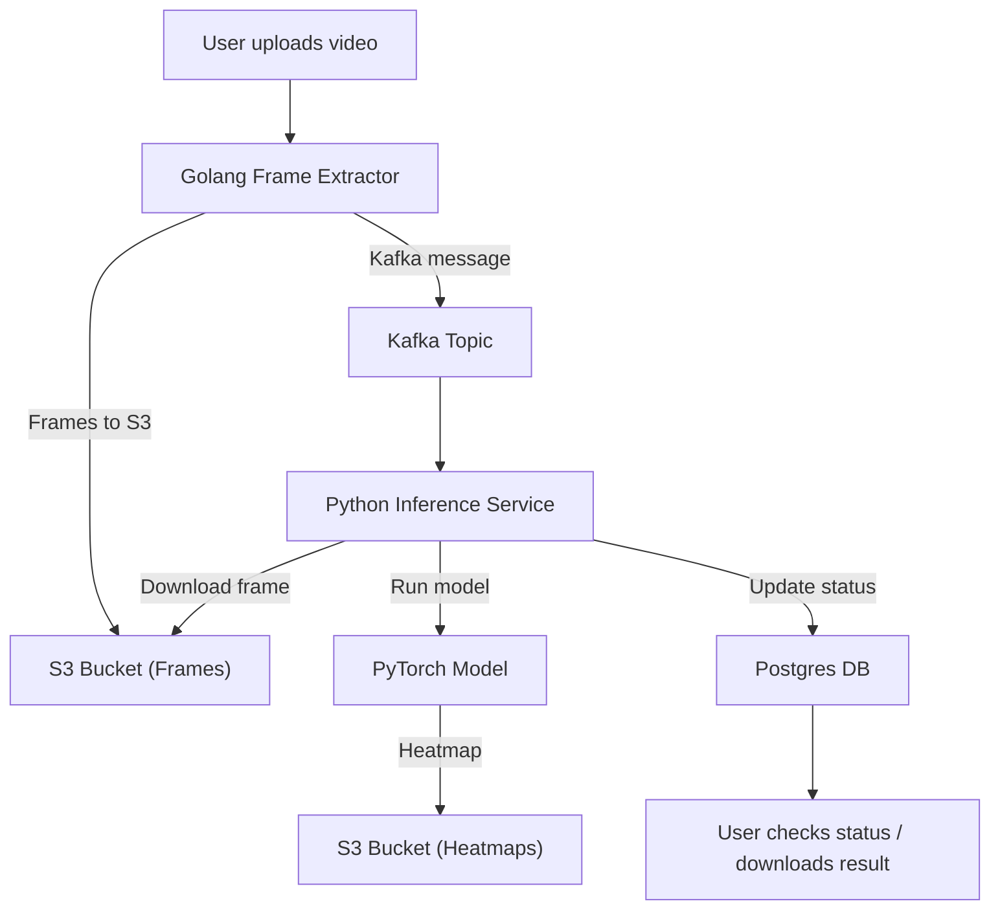

# DorsoDepth

DorsoDepth utilizes a **distributed microservices architecture** for scalable, fault-tolerant video processing and depth estimation. The system follows an **event-driven** design to efficiently handle large video workloads with asynchronous communication.

### Core Components

#### **Go Producer Service**
- Extracts video frames using **FFmpeg** at configurable FPS
- Uploads frames to **AWS S3** with structured directories
- Publishes frame metadata to **Apache Kafka**
- Tracks videos and frames using a **PostgreSQL** database

#### **Apache Kafka**
- Reliable message queue between producer and consumer services
- Asynchronous communication with guaranteed message delivery
- Maintains **message order per video** via partitioning
- Supports **horizontal scalability** via consumer groups

#### **Python Consumer Service**
- Consumes Kafka messages with frame metadata
- Downloads frames from S3
- Runs **PyTorch (FlyDepth)** model for depth estimation
- Uploads depth heatmaps back to S3
- Updates processing status in PostgreSQL

#### **Data Storage**
- **AWS S3**: Stores raw frames and generated heatmaps
- **PostgreSQL**: Stores metadata and processing job status

---

### Result:
#### Input (Input Video)
https://github.com/user-attachments/assets/a63b0400-a3ad-46f6-b1cf-0ace34962a0f

#### Output: (Generated Heatmap)
https://github.com/user-attachments/assets/68b03873-323d-4b72-8760-5b74cd541834

### Architecture

