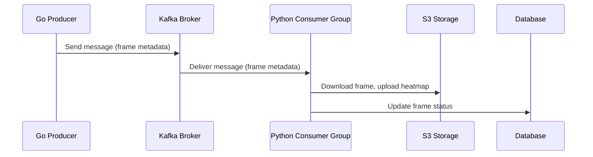

# DorsoDepth

```mermaid
sequenceDiagram
    participant Go as Go Producer
    participant Kafka as Kafka Broker
    participant Py as Python Consumer Group
    participant S3 as S3 Storage
    participant DB as Database
    
    Go->>Kafka: Send message (frame metadata)
    Kafka->>Py: Deliver message (frame metadata)
    Py->>S3: Download frame, upload heatmap
    Py->>DB: Update frame status
```
