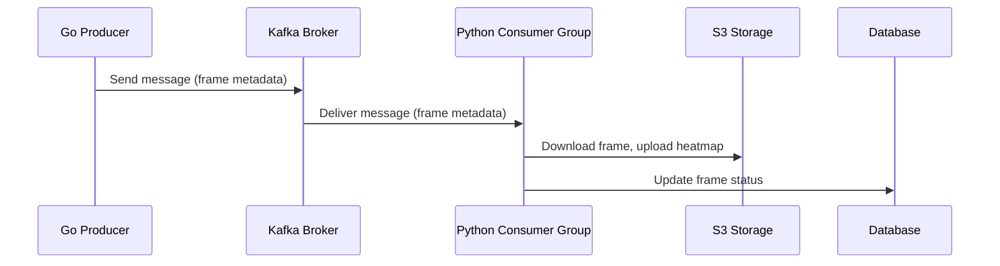

# DorsoDepth

DorsoDepth utilizes a **distributed microservices architecture** for scalable, fault-tolerant video processing and depth estimation. The system follows an **event-driven** design to efficiently handle large video workloads with asynchronous communication.

### Core Components

#### **Go Producer Service**
- Extracts video frames using **FFmpeg** at configurable FPS
- Uploads frames to **AWS S3** with structured directories
- Publishes frame metadata to **Apache Kafka**
- Tracks videos and frames using a **PostgreSQL** database

#### **Apache Kafka**
- Reliable message queue between producer and consumer services
- Asynchronous communication with guaranteed message delivery
- Maintains **message order per video** via partitioning
- Supports **horizontal scalability** via consumer groups

#### **Python Consumer Service**
- Consumes Kafka messages with frame metadata
- Downloads frames from S3
- Runs **PyTorch (FlyDepth)** model for depth estimation
- Uploads depth heatmaps back to S3
- Updates processing status in PostgreSQL

#### **Data Storage**
- **AWS S3**: Stores raw frames and generated heatmaps
- **PostgreSQL**: Stores metadata and processing job status

---

### Processing Pipeline

1. **Video Upload** → FastAPI receives video and triggers job
2. **Frame Extraction** → Go service extracts frames and stores them in S3
3. **Metadata Publishing** → Kafka queues frame metadata
4. **Concurrent Processing** → Python consumers process frames in parallel
5. **Depth Estimation** → PyTorch model infers depth heatmaps
6. **Result Storage** → Heatmaps uploaded to S3
7. **Status Tracking** → PostgreSQL updated with results
8. **Video Assembly** → Final output assembled from processed heatmaps

---

### Technical Stack

- **Broker**: Apache Kafka (with Zookeeper)
- **Database**: PostgreSQL (optimized schema)
- **Storage**: AWS S3 (structured buckets)
- **Containerization**: Docker Compose (local dev/test)
- **API**: FastAPI (with background tasks)
- **ML Model**: PyTorch-based (FlyDepth)

---

### Scalability & Reliability

- **Parallelism**: Multiple consumers handle frames simultaneously
- **Fault Tolerance**: Kafka ensures persistent and ordered delivery
- **Stateless Services**: Easy to scale and restart
- **Event-Driven Flow**: Loose coupling between components
- **Microservices**: Isolated resource management and independent scaling

---

This system enables **efficient and reliable video processing** with real-time updates through the web interface.

